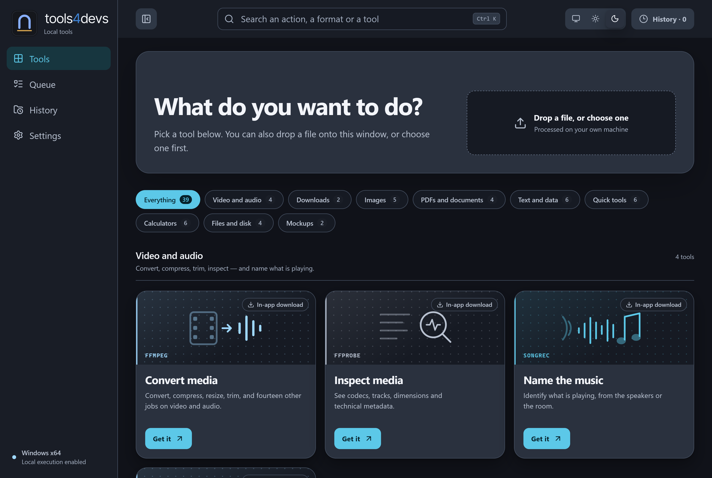
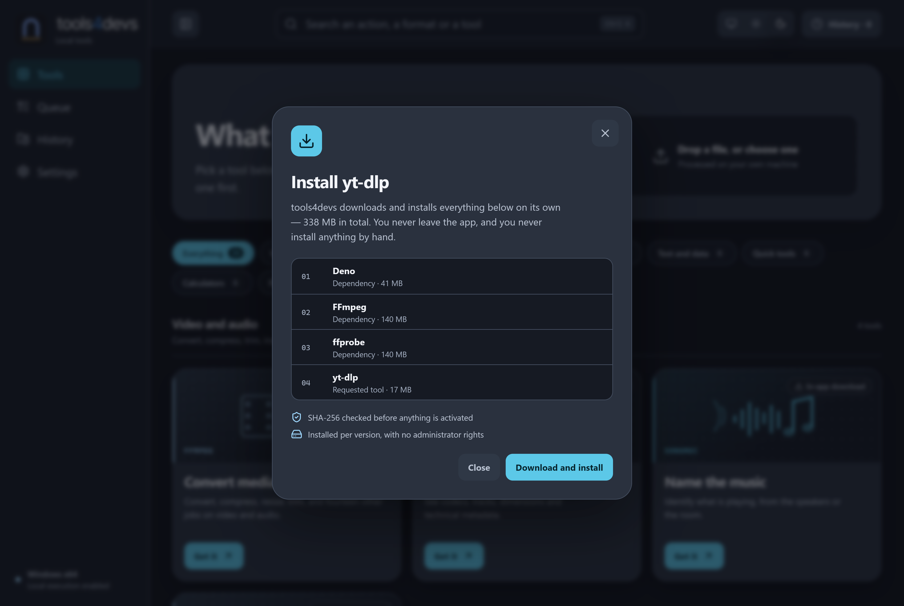

<div align="center">


# tools4devs

[](https://github.com/diegormirhan/toolhaven-desktop/releases)
[](LICENSE)
[](#install)
[](apps/desktop/src-tauri/)
[](apps/desktop/src/)

> Convert video, download from YouTube, edit PDFs, enlarge photos and read text from scans on Windows, without typing a command.

</div>



tools4devs puts twenty-five open-source tools (FFmpeg, yt-dlp, qpdf, ImageMagick, Tesseract and others) in one window with one queue. Nine of them ship inside the installer. The app downloads, verifies and installs the rest on its own, and shows the download size before it starts.

It also has about ninety small tools built in: text, hashes, dates, calculators, colours, CSS generators, QR codes, test data and chat or post mockups. These run inside the app and need nothing installed.

You don't need a browser, a package manager or PATH changes. Everything runs on your machine, in English or Brazilian Portuguese.

## Features

- **Nothing to install by hand.** Each tool is pinned to an exact URL, version and SHA-256. A download that doesn't match its digest is refused, and nothing asks for administrator rights.
- **Tools grouped by result.** Categories are named after what you want to get (a smaller video, a merged PDF, the text from a scan), not after the project that does the work.
- **A queue that keeps running.** Start a job, close the tool, and the job continues. Stopping a job ends its whole process tree, and the history survives a restart.
- **Built-in quick tools.** Case changes, Base64, hashes, date math, financing and BMI calculators, colour conversion, CSS generators, CSS and HTML minifiers, QR codes and barcodes, CPF, CNPJ and test card numbers, dice and raffles. Results show up as you type.
- **Chat and post mockups.** Build a WhatsApp, iMessage or Instagram DM conversation, or a tweet or Instagram post, and save it as an image.
- **Automatic updates.** Updates are checked against a signature built into the app, and a running job is never interrupted. You install the update with a button when you are ready.
- **English and Brazilian Portuguese**, switched in Settings. Tools, options, errors and the queue are all translated.
- **No account, no cloud, no telemetry.** OCR and photo upscaling use local models on your own CPU or GPU. The three network lookups and reverse image search are the only features that contact an outside server, and they say so on screen.

## Install

Download the installer from the [latest release](https://github.com/diegormirhan/toolhaven-desktop/releases/latest) and run it. Requires Windows 10 or 11, 64-bit.

| File | What it is |
| --- | --- |
| `tools4devs_<version>_x64-setup.exe` | Installer (recommended) |
| `tools4devs_<version>_x64_en-US.msi` | MSI, for managed deployment |
| `tools4devs_<version>_x64-portable.zip` | Portable, unzip and run |

> [!NOTE]
> The installer isn't code-signed yet, so SmartScreen shows a warning the first time you run it. Each release includes SHA-256 checksums. The portable build doesn't update itself.

## The catalog

| Category | Tools | What you can do |
| --- | --- | --- |
| **Video and audio** | FFmpeg, ffprobe, SongRec, MKVToolNix | transcode, compress, trim, make GIFs and contact sheets, inspect codecs, remux to MKV, identify the song that is playing |
| **Downloads** | yt-dlp, gallery-dl | download video and audio from a link, and image galleries |
| **Images** | libvips, Nomos8kSC, reverse image search, ImageMagick, Oxipng, ExifTool | resize, crop, convert, upscale with a model, find where a picture came from, optimise PNG, read and remove metadata |
| **PDFs and documents** | qpdf, Poppler, Tesseract, Pandoc | merge, split, rotate, protect, extract text, render a page, OCR into a searchable PDF, convert between formats |
| **Text and data** | jq, yq, Miller, ripgrep, fd, Difftastic | JSON and YAML, CSV to JSON, search, find files, structural diff |
| **Quick tools** | built in | text, codes and hashes, test data, CSS generators, minify and format, QR codes and barcodes |
| **Calculators** | built in | dates and time, math and finance, colours, everyday calculators, network lookups, random picks |
| **Files and disk** | 7-Zip, Dust, tokei, hexyl | archives, disk usage, line counts, hex view |
| **Mockups** | built in | chat and post images |



## How it works

```
apps/desktop/src/          React 19 + TypeScript interface
apps/desktop/src-tauri/    Rust host: adapters, component store, process supervision
tooling/tools.json         every tool, pinned to a URL, a version and a SHA-256
scripts/                   manifest validation, staging, release manifest
tests/                     manifest, installation, execution and stylesheet rules
```

Some design decisions:

- **No shell.** An operation is a typed request (tool, operation, inputs, output, options). A resolver turns it into an executable name and a list of arguments. No string is passed to a shell, so a file named `; rm -rf` is just a file name.
- **Components are stored by digest.** FFmpeg and ffprobe come from the same archive, so it is downloaded once. Installs are staged in a separate folder under `%LOCALAPPDATA%` and activated with an atomic rename. Nothing is written to Program Files.
- **Pinned versions come first.** The app looks in `<install dir>/tools/`, then the component store, then PATH. Git for Windows ships an Xpdf `pdftotext.exe` that is often first on PATH, so Poppler is found through a binary Xpdf doesn't include. A test covers this.

## Build it yourself

You need Node 24+, Rust (MSVC toolchain) and the Visual Studio C++ build tools.

```bash
npm install
npm run tools:stage   # downloads and verifies the bundled tools
npm run tauri:dev
```

```bash
npm test              # manifest, execution, interface and component tests
npm run tauri:build   # installer, MSI and portable build
```

> [!IMPORTANT]
> A release that clients can update to must be signed. Set both variables, even if the key has no password. Without the second one the build waits for a password prompt and produces no signature.
>
> ```bash
> TAURI_SIGNING_PRIVATE_KEY="$(cat ~/.toolhaven/updater.key)" \
> TAURI_SIGNING_PRIVATE_KEY_PASSWORD="" npm run tauri:build
> ```

To cut a release, run one command:

```bash
npm run release -- 3.2.2
```

It sets the version everywhere, adds a [CHANGELOG.md](CHANGELOG.md) section from the commits since the last tag (unless you already wrote one), runs the tests, builds and signs, and puts the installer, MSI, portable zip, signatures, `checksums.txt`, `latest.json` and `RELEASE-NOTES.md` in `Releases/<version>/`. It signs with `~/.toolhaven/updater.key` unless `TAURI_SIGNING_PRIVATE_KEY` is set. It doesn't commit, tag or publish.

Before a release, check that every pinned download still installs and runs (about 900 MB):

```bash
cargo test --manifest-path apps/desktop/src-tauri/Cargo.toml --lib -- --ignored --nocapture installs_and_runs_every_tool
```

## Upgrade compatibility

The 3.4.0 release uses tools4devs for the executable, installers and release artifacts. It publishes tools4devs.json together with an identical latest.json for existing updaters. Internal installer identities, preference keys and component paths retain their legacy values to preserve existing installations and data. See [the Windows upgrade contract](apps/desktop/src-tauri/installer/README.md) before changing them.

## Screenshots

The README uses lossless PNG captures at 3840 × 2580 pixels, rendered at 3x rather than enlarged from older images. The landing page serves lossless WebP versions, including the original resolution and responsive sizes.

With the development server running:

```bash
npm run screenshots
npm run screenshots -- --lang pt
```

## Languages

English and Brazilian Portuguese, chosen in Settings and saved on the machine. Translations use the English sentence as the key, so the source code shows the real text, and a missing translation falls back to English instead of showing a key.

```
apps/desktop/src/i18n/pt.ts            the interface
apps/desktop/src/i18n/catalog-pt.ts    the tools, their operations and options
tests/interface/translations.test.mjs  fails on any string without a translation
```

## Known limitations

See **[LIMITATIONS.md](LIMITATIONS.md)** for what this release can't do: formats 7-Zip can't read, what the upscaler needs from your GPU, the parts of the update path that are still untested, and more.

## Stack

`Tauri 2`, `Rust` (host, adapters, component store), `React 19`, `TypeScript`, `Vite`, and `ureq`, `zip` and `sha2` for the installer. There are no runtime dependencies besides the tools themselves.

The project's own code is MIT licensed. Each third-party executable keeps its own licence, recorded with its version, origin, download URL and SHA-256 in `vendor/THIRD-PARTY-NOTICES.txt`, which the build generates.
